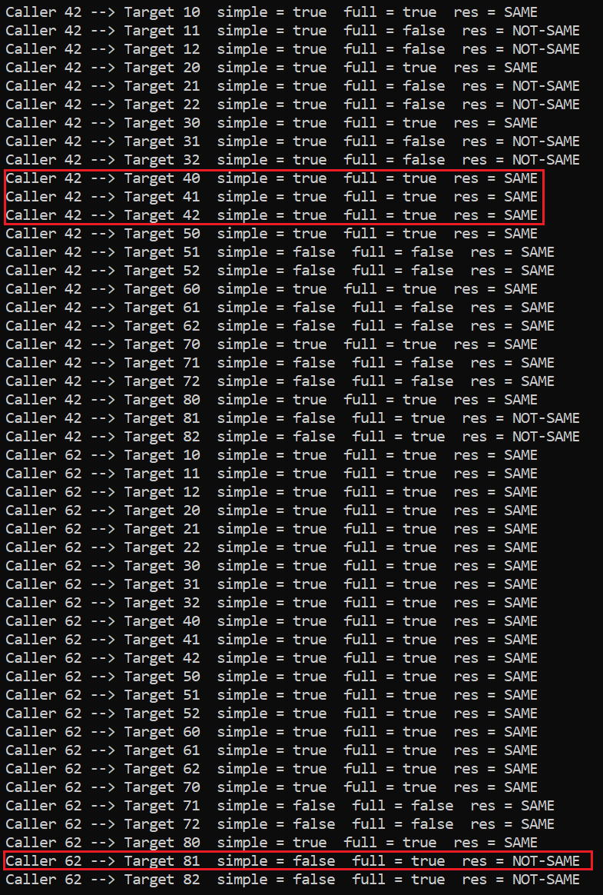

# PPL
The demo of RtlTestProtectedAccess() and RtlProtectedAccess involved in creation Protected Process. 

```c
bool RtlTestProtectedAccessFull(PS_PROTECTION CallerProt, PS_PROTECTION TargetProt)
{
    // Allow access to the non-protected processes - the mimikatz case
    if (TargetProt.Type == 0)
        return true;

    // Restrict access to the Caller with lower protection Type than the Target
    if (CallerProt.Type < TargetProt.Type)
        return false;

    // Check whether the Target Signer value can be accessed from the Caller Signer value
    auto CallerDominateMask = RtlProtectedAccess[CallerProt.Signer].DominateMask;
    auto TargetMask = (1 << TargetProt.Signer);
    if (CallerDominateMask & TargetMask)
    {
        return true;
    }
    return false;
	//return bittest(&RtlProtectedAccess[CallerProt.Signer].DominateMask, TargetProt.Signer);
}
```


The output is below:


